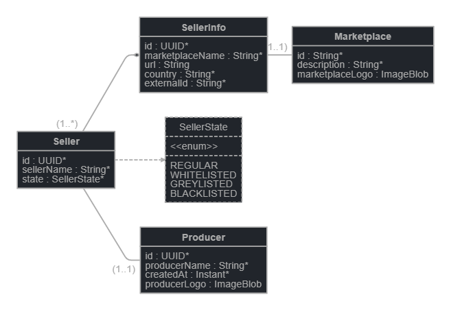

<!DOCTYPE html>
<html lang="en">
<head>
    <meta charset="UTF-8">
    <meta name="viewport" content="width=device-width, initial-scale=1.0">
    <title>GraphQL Data Fetching README</title>
</head>
<body>
    <h1>GraphQL Data Fetching in Spring Boot Project</h1>

    <h2>Overview</h2>
    
Briefly introduce the task or feature you were working on, such as integrating GraphQL data fetching in your Spring Boot project.

    <h2>GraphQL Schema</h2>
    
Provide an overview of the GraphQL schema you defined for your project. Include details about the types (Query, Seller, SellerFilter, PageInput, SellerSortBy, SellerState, etc.), input types, enums, and relationships between types.

 <!-- Include the image with a descriptive alt text -->

    
    <h2>Data Fetcher Implementation</h2>
    
Explain how you implemented the data fetcher class (<code>SellersDataFetcher</code>) to handle GraphQL queries for fetching seller data.

    <pre><code>public class SellersDataFetcher implements DataFetcher&lt;List&lt;Seller&gt;&gt; {
        // Your code here
    }</code></pre>
    
Mention any dependencies injected into the data fetcher, such as the <code>SellerRepository</code>.

    <h2>SellerFilter Class</h2>
    
Describe the purpose of the <code>SellerFilter</code> class and how it is used to filter seller data based on <code>SellerState</code>.

    <pre><code>public class SellerFilter {
        // Your code here
    }</code></pre>

    <h2>Error Handling</h2>
    
Describe any error messages or exceptions you encountered during implementation, such as the "class java.util.LinkedHashMap cannot be cast" error.

    
Explain how you debugged and resolved the error, providing insights into potential issues like argument casting or GraphQL query structure.

    <h2>GraphQL Query Example</h2>
    
Provide an example GraphQL query that demonstrates how to fetch sellers using the <code>sellersGraphQl</code> field with <code>filter</code>, <code>page</code>, and <code>sortBy</code> arguments.

    <pre><code>query {
    sellersGraphQl(
        filter: { state: REGULAR },
        page: { page: 1, size: 10 },
        sortBy: NAME_ASC
    ) {
        meta {
            totalPages
            totalItems
            currentPage
            hasNextPage
            hasPreviousPage
        }
        data {
            id
            sellerName
            state
        }
    }

}</code></pre>

    <h2>Conclusion</h2>
    
Summarize the key points covered in the README related to GraphQL data fetching for sellers in your project.

    
Mention any additional resources or references used for implementing GraphQL in your Spring Boot application.

</body>
</html>
